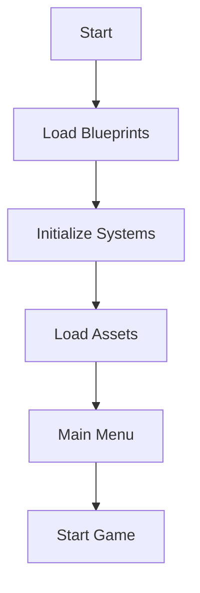
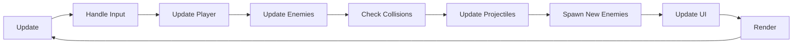

# 🎮 Rakovinobijec - Kompletní průvodce pro vývojáře

## 📚 Obsah
1. [Úvod do architektury](#úvod-do-architektury)
2. [Blueprint systém](#blueprint-systém)
3. [Praktické návody](#praktické-návody)
4. [Development Tools](#development-tools)
5. [XP a progression systém](#xp-a-progression-systém)
6. [I18n lokalizace](#i18n-lokalizace)
7. [Troubleshooting](#troubleshooting)

---

## 🏗️ Úvod do architektury

### Co je Rakovinobijec?
Rakovinobijec je 2D top-down survival hra, kde hráč bojuje proti rakovinným buňkám. Hra je postavena na **Phaser 3** enginu a používá **100% data-driven architekturu PR7**.

### Základní principy PR7
- **Žádné hardcoded hodnoty** - vše je v datech
- **Single Source of Truth** - ConfigResolver je jediný zdroj hodnot
- **Blueprint systém** - všechny entity jsou definované v JSON5 souborech
- **Žádné legacy kódy** - pouze moderní systémy
- **VFX/SFX systémy** - data-driven přes registry nebo direct file paths
- **GraphicsFactory** - centralizované vytváření grafických objektů s poolingem
- **Capability-based design** - oddělení Phaser API od business logiky
- **Thin Composer pattern** - minimální hlavní třídy, delegace na komponenty
- **Pure functions** - behaviors bez side-effects
- **Max 500 LOC** - žádné monolitické soubory

### Adresářová struktura
```
/data/blueprints/
├── enemy/           # Definice nepřátel
├── boss/            # Definice bossů
├── spawn/           # Spawn tabulky (levely)
├── powerup/         # Power-upy
├── projectile/      # Projektily
├── templates/       # Šablony pro rychlé vytváření
└── /data/config/    # Systémové konfigurace
└── /data/i18n/      # Lokalizace (cs.json, en.json)
```

---

## 🎯 Blueprint systém

### Co je blueprint?
Blueprint je JSON5 soubor, který definuje entitu ve hře. Každý nepřítel, boss, power-up nebo projektil má svůj blueprint.

### Základní struktura blueprintu
```json5
{
  id: "entity.unique_id",        // Unikátní identifikátor
  type: "enemy",                 // Typ entity
  // ... další pole podle typu
}
```

### Pravidla pojmenování
- **Enemy**: `enemy.nazev_nepritel`
- **Boss**: `boss.nazev_boss`
- **Power-up**: `powerup.nazev_powerup`
- **Projektil**: `projectile.nazev_projektil`
- **Loot**: `drop.nazev_drop`

---

## 🏛️ Architektonické vzory

### Capability-based Design (Enemy systém)

Oddělujeme Phaser API od business logiky pomocí capability interface:

```javascript
// 1. Core třída (EnemyCore.js) - Phaser integrace
class EnemyCore extends Phaser.Physics.Arcade.Sprite {
    // Capability methods - abstrakce Phaser API
    getPos() { return { x: this.x, y: this.y }; }
    setVelocity(vx, vy) { this.body.setVelocity(vx, vy); }
    shoot(pattern, opts) { /* ProjectileSystem */ }
    playSfx(id) { /* AudioSystem */ }
    spawnVfx(id, pos) { /* VFXSystem */ }
}

// 2. Behavior - pure function, žádné Phaser API
export function chase(cap, cfg, dt) {
    const pos = cap.getPos();        // Použití capability
    const player = cap.scene?.player;
    
    // Výpočet bez side-effects
    const dx = player.x - pos.x;
    const dy = player.y - pos.y;
    
    // Aplikace přes capability
    cap.setVelocity(vx, vy);
    
    return nextState;  // Vrací další stav
}

// 3. Router (EnemyBehaviors.js) - state machine
class EnemyBehaviors {
    update(time, delta) {
        const behavior = BEHAVIORS[this.state];
        const nextState = behavior(this.capability, cfg, dt);
        if (nextState) this.transitionTo(nextState);
    }
}

// 4. Composer (Enemy.js) - thin orchestrator
class Enemy extends EnemyCore {
    constructor(scene, blueprint, opts) {
        super(scene, blueprint, opts);
        this.behaviors = new EnemyBehaviors(this);
    }
    update(time, delta) {
        this.behaviors.update(time, delta);
    }
}
```

### Thin Composer Pattern

Hlavní třídy jsou pouze orchestrátory:

```javascript
// ŠPATNĚ - monolitický soubor (900+ LOC)
class Enemy {
    constructor() { /* 100 řádků */ }
    update() { /* 50 řádků AI logiky */ }
    takeDamage() { /* 30 řádků */ }
    shootProjectile() { /* 40 řádků */ }
    // ... dalších 20 metod
}

// SPRÁVNĚ - thin composer
class Enemy extends EnemyCore {
    constructor(scene, blueprint, opts) {
        super(scene, blueprint, opts);        // Core
        this.behaviors = new EnemyBehaviors(this); // AI
    }
    
    update(time, delta) {
        this.behaviors.update(time, delta);   // Delegace
    }
}
```

### DisposableRegistry Pattern

Správa zdrojů a prevence memory leaks:

```javascript
class EnemyCore {
    constructor(scene) {
        // Registrace pro automatický cleanup
        if (scene.disposableRegistry) {
            this.disposables = scene.disposableRegistry.create(this);
        }
    }
    
    schedule(fn, ms) {
        const timer = this.scene.time.delayedCall(ms, fn);
        // Automatické sledování pro cleanup
        if (this.disposables?.trackTimer) {
            this.disposables.trackTimer(timer);
        }
        return timer;
    }
    
    cleanup() {
        // Automatický cleanup všech timerů
        if (this.disposables) {
            this.disposables.disposeAll();
        }
    }
}
```

---

## 🔧 Refaktoring velkých souborů

### Kdy refaktorovat?
- Soubor má **více než 500 LOC**
- Třída má **více než 10 metod**
- Mixing Phaser API s business logikou
- Cyklické závislosti

### Postup refaktoringu (příklad Enemy)

#### 1. Analýza a rozdělení
```bash
# Analyzujte velikost
wc -l js/entities/Enemy.js  # 912 řádků - nutný refaktor!

# Identifikujte komponenty
- Core/Phaser funkcionalita → EnemyCore.js
- AI behaviors → EnemyBehaviors.js + behaviors/*.js
- Hlavní interface → Enemy.js (thin composer)
```

#### 2. Vytvoření capability interface
```javascript
// EnemyCore.js - všechna Phaser API zde
class EnemyCore extends Phaser.Physics.Arcade.Sprite {
    // Capability methods pro behaviors
    getPos() { return { x: this.x, y: this.y }; }
    setVelocity(vx, vy) { this.body.setVelocity(vx, vy); }
    // ... další capabilities
}
```

#### 3. Extrakce behaviors jako pure functions
```javascript
// behaviors/chase.js - žádné Phaser API!
export function chase(cap, cfg, dt) {
    // Pure function - pouze výpočty
    const pos = cap.getPos();
    // ... logika
    return nextState;
}
```

#### 4. Guard rules check
```bash
# Spusťte guard script
./dev/refactor/check_enemy_guards.sh

# Ověřte:
✅ No Phaser API in behaviors
✅ No circular dependencies
✅ Pure functions only
```

#### 5. Memory leak test
```javascript
// V konzoli
for(let i = 0; i < 100; i++) {
    DEV.spawnEnemy("enemy.viral_swarm");
}
DEV.killAll();
// Check memory v DevTools
```

---

## 📋 Praktické návody

### 🆕 Přidání nového nepřítele (3 kroky)

**1. Vytvoř blueprint** v `/data/blueprints/enemy/`
```bash
cp data/blueprints/templates/enemy.json5 data/blueprints/enemy/enemy.novy_nepritel.json5
```

**2. Nastav základní parametry:**
```json5
{
  id: "enemy.novy_nepritel",
  type: "enemy",
  stats: { hp: 25, damage: 8, speed: 80, size: 16, xp: 4 },
  ai: { behavior: "chase", params: { aggroRange: 250 } },
  lootTable: "lootTable.level1.common",
  sfx: { hit: "sound/npc_hit.mp3", death: "sound/npc_death.mp3" }
}
```

**3. Registruj a testuj:**
- Přidej do `/data/registries/index.json`
- Test: `DEV.spawnEnemy("enemy.novy_nepritel")`
- Přidej do spawn tabulky v `/data/blueprints/spawn/`

### 🐉 Přidání nového bosse (3 kroky)

**1. Zkopíruj template:**
```bash
cp data/blueprints/templates/boss.json5 data/blueprints/boss/boss.novy_boss.json5
```

**2. Nastav fáze a schopnosti:**
```json5
{
  id: "boss.novy_boss",
  type: "boss",
  stats: { hp: 1500, damage: 25, speed: 50, size: 48, xp: 200 },
  mechanics: {
    phases: [
      { hpThreshold: 1.0, abilities: ["basic_attack"] },
      { hpThreshold: 0.5, abilities: ["basic_attack", "rage_mode"] }
    ]
  }
}
```

**3. Test v Boss Playground:**
- Stiskni **F7** pro otevření Boss Playground
- Vyber svého bosse ze seznamu
- Klikni **SPAWN** pro test

### ⚡ Přidání nového power-upu (3 kroky)

**1. Vytvoř blueprint:**
```json5
{
  id: "powerup.novy_powerup",
  type: "powerup",
  modifiers: [
    { stat: "damage", type: "multiply", value: 1.5, duration: 10000 }
  ],
  levels: [
    { level: 1, modifiers: [{ value: 1.5 }] },
    { level: 2, modifiers: [{ value: 1.8 }] }
  ]
}
```

**2. Přidej do loot tabulek** v `/data/blueprints/loot/`

**3. Test:** `DEV.spawnDrop("powerup.novy_powerup")`

### 🎮 SFX a VFX systém

**DOPORUČENÝ PŘÍSTUP: Direct File Paths**
```json5
// V blueprintu - jednoduché a jasné
sfx: { 
  spawn: "sound/npc_spawn.mp3", 
  hit: "sound/npc_hit.mp3", 
  death: "sound/npc_death.mp3" 
}
```

**Výhody:**
- Žádná registrace potřeba
- Méně abstrakcí = méně chyb
- Automatický pooling a volume management
- Konzistence s loot systémem

**VFX použití:**
```json5
vfx: {
  spawn: "vfx.enemy.spawn.default",
  hit: "vfx.hit.spark.small",
  death: "vfx.enemy.death.burst"
}
```

### 🎯 Graphics Factory - PR7 Compliant

**SPRÁVNÉ použití:**
```javascript
// Vytvoření grafického objektu
this.graphics = this.scene.graphicsFactory.create();

// Cleanup - vrácení do poolu
this.scene.graphicsFactory.release(this.graphics);
```

**Všechny vizuální konstanty v blueprintech:**
```json5
"ability": {
  "innerRadius": 30,
  "beamColor": 0xCCFF00,
  "strokeWidth": 2
}
```

---

## 🐉 Boss blueprinty

### Struktura boss blueprintu

```json5
{
  id: "boss.karcinogenni_kral",
  type: "boss",
  
  stats: {
    hp: 1500,                    // Hodně životů (500-5000)
    damage: 30,                  // Vysoké poškození
    speed: 60,                   // Obvykle pomalejší
    size: 48,                    // Větší než normální nepřátelé
    armor: 5,                    // Vysoká odolnost
    xp: 100                      // Hodně XP
  },
  
  // Fáze bosse
  mechanics: {
    phases: [
      {
        hpThreshold: 1.0,        // 100% HP
        abilities: ["summon_minions", "toxic_wave"],
        attackInterval: 3000,
        moveSpeed: 60
      },
      {
        hpThreshold: 0.5,        // 50% HP
        abilities: ["summon_minions", "toxic_wave", "rage_mode"],
        attackInterval: 2000,
        moveSpeed: 80
      },
      {
        hpThreshold: 0.25,       // 25% HP - Enrage
        abilities: ["toxic_nova", "summon_swarm", "berserk"],
        attackInterval: 1500,
        moveSpeed: 100
      }
    ],
    
    // Schopnosti
    abilities: {
      summon_minions: {
        type: "spawn",
        enemyId: "enemy.viral_swarm",
        count: 5,
        cooldown: 10000
      },
      toxic_wave: {
        type: "projectile_wave",
        projectileId: "projectile.toxic_wave",
        count: 8,
        damage: 20,
        cooldown: 5000
      },
      rage_mode: {
        type: "self_buff",
        speedMultiplier: 1.5,
        damageMultiplier: 1.3,
        duration: 10000
      }
    }
  },
  
  display: {
    name: "Karcinogenní král",
    title: "Vládce mutací",
    healthBarSize: "large",      // Velký health bar
    showPhaseTransitions: true   // Ukázat přechody fází
  }
}
```

### Typy boss schopností

#### Spawn - Vyvolání pomocníků
```json5
abilities: {
  summon_minions: {
    type: "spawn",
    enemyId: "enemy.viral_swarm",
    count: 5,
    pattern: "circle",           // circle/line/random
    cooldown: 10000
  }
}
```

#### Projektilové útoky
```json5
abilities: {
  projectile_burst: {
    type: "projectile_wave",
    projectileId: "projectile.boss_bullet",
    count: 12,                   // Počet projektilů
    spreadAngle: 360,            // Úhel rozptylu
    damage: 25,
    speed: 200,
    cooldown: 3000
  }
}
```

#### Self-buff - Posílení
```json5
abilities: {
  enrage: {
    type: "self_buff",
    speedMultiplier: 2.0,
    damageMultiplier: 1.5,
    defenseMultiplier: 0.5,      // Snížená obrana
    duration: 15000,
    vfx: "vfx.boss.enrage"
  }
}
```

#### Area damage - Plošné útoky
```json5
abilities: {
  toxic_nova: {
    type: "area_damage",
    radius: 200,
    damage: 50,
    damageType: "poison",
    duration: 5000,               // DoT trvání
    vfx: "vfx.boss.nova"
  }
}
```

---

## 🌊 Spawn tabulky a levely

### Struktura spawn tabulky (level)

```json5
{
  id: "spawnTable.level1",
  type: "spawnTable",
  level: 1,
  
  // === VLNY NEPŘÁTEL ===
  enemyWaves: [
    {
      enemyId: "enemy.necrotic_cell",
      weight: 100,              // Váha spawnu (0-100)
      countRange: [1, 2],       // Spawn 1-2 nepřátel
      interval: 2000,           // Každé 2 sekundy
      startAt: 0,               // Začít od 0ms
      endAt: 30000              // Končit po 30s
    },
    {
      enemyId: "enemy.viral_swarm",
      weight: 80,
      countRange: [2, 4],
      interval: 3000,
      startAt: 10000,           // Začít po 10s
      endAt: 60000
    }
  ],
  
  // === ELITNÍ NEPŘÁTELÉ ===
  eliteWindows: [
    {
      enemyId: "enemy.viral_swarm_alpha",
      weight: 30,               // 30% šance
      countRange: [1, 1],
      cooldown: 15000,          // Minimálně 15s mezi spawny
      startAt: 20000,           // Začít po 20s
      endAt: 120000
    }
  ],
  
  // === UNIKÁTNÍ/VZÁCNÍ NEPŘÁTELÉ ===
  uniqueSpawns: [
    {
      enemyId: "unique.golden_cell",
      weight: 2,                // 2% šance
      countRange: [1, 1],
      cooldown: 60000,
      startAt: 30000,
      endAt: 999999,
      conditions: {             // Podmínky pro spawn
        playerLevel: { min: 5 },
        enemiesKilled: { min: 50 }
      }
    }
  ],
  
  // === BOSS TRIGGERY ===
  bossTriggers: [
    {
      condition: "time",        // Typ podmínky
      value: 60000,             // Po 60 sekundách
      bossId: "boss.radiation_core",
      spawnDelay: 2000,         // Delay před spawnem
      clearEnemies: false       // Vyčistit obrazovku
    },
    {
      condition: "kills",       // Po X zabitích
      value: 100,
      bossId: "boss.radiation_core",
      spawnDelay: 3000,
      clearEnemies: true
    }
  ],
  
  // === LOOT TABULKY ===
  lootTables: {
    normal: {
      "drop.xp.small": 60,      // 60% šance
      "drop.xp.medium": 30,
      "drop.leukocyte_pack": 8,
      "drop.metotrexat": 0.5
    },
    elite: {
      "drop.xp.large": 40,
      "drop.leukocyte_pack": 25,
      "powerup.immuno_boost": 3
    },
    boss: {
      "drop.xp.large": 100,     // 100% šance
      "powerup.immuno_boost": 30,
      "powerup.metabolic_haste": 20
    }
  },
  
  // === NASTAVENÍ OBTÍŽNOSTI ===
  difficulty: {
    enemyHpMultiplier: 1.0,     // Násobič HP
    enemyDamageMultiplier: 1.0,
    enemySpeedMultiplier: 1.0,
    spawnRateMultiplier: 1.0,
    eliteFrequency: 0.8,
    targetTTK: 3000,            // Time to kill (ms)
    progressiveScaling: {
      hpGrowth: 0.001,          // +0.1% HP za sekundu
      damageGrowth: 0.0008,
      spawnGrowth: 0.0015
    }
  },
  
  // === META INFORMACE ===
  meta: {
    name: "level1",
    displayName: "Úroveň 1 - Základní výzva",
    description: "Začátečnická obtížnost",
    estimatedDuration: 120000,  // 2 minuty
    recommendedLevel: 1,
    tags: ["beginner", "tutorial"]
  }
}
```

### Časová osa levelu

```
Čas (s) | Události
--------|----------------------------------------------------------
0       | Start, spawn základních nepřátel (necrotic_cell)
10      | Přidají se viral_swarm
20      | Možnost spawnu prvních elitních nepřátel
30      | Možnost spawnu unikátních nepřátel
60      | BOSS SPAWN (časová podmínka)
120     | Konec levelu (pokud boss poražen)
```

### Typy boss triggerů

#### Time trigger - Časový
```json5
{
  condition: "time",
  value: 60000,              // Po 60 sekundách
  bossId: "boss.radiation_core",
  spawnDelay: 2000,
  clearEnemies: true
}
```

#### Kill trigger - Počet zabitých
```json5
{
  condition: "kills",
  value: 100,                // Po 100 zabitích
  bossId: "boss.onkogen",
  spawnDelay: 3000,
  clearEnemies: true
}
```

#### Wave trigger - Číslo vlny
```json5
{
  condition: "wave",
  value: 5,                  // Po 5. vlně
  bossId: "boss.final",
  spawnDelay: 5000,
  clearEnemies: true
}
```

---

## 💎 Loot systém

### Struktura loot tabulky

```json5
{
  id: "lootTable.level1.common",
  type: "lootTable",
  
  drops: {
    // XP orby
    "drop.xp.small": {
      weight: 0.6,           // 60% šance
      amount: 1,
      value: 5               // 5 XP
    },
    "drop.xp.medium": {
      weight: 0.3,
      amount: 1,
      value: 10
    },
    "drop.xp.large": {
      weight: 0.1,
      amount: 1,
      value: 25
    },
    
    // Léčení
    "drop.leukocyte_pack": {
      weight: 0.08,          // 8% šance
      amount: 1,
      healAmount: 20         // Vyléčí 20 HP
    },
    
    // Speciální
    "drop.metotrexat": {
      weight: 0.01,          // 1% šance
      amount: 1,
      effect: "instant_kill_all"
    },
    
    // Power-upy (jen z elit/bossů)
    "powerup.immuno_boost": {
      weight: 0.03,
      amount: 1
    }
  }
}
```

### Typy dropů

#### XP Orby
```json5
"drop.xp.small": { weight: 0.6, value: 5 }
"drop.xp.medium": { weight: 0.3, value: 10 }
"drop.xp.large": { weight: 0.1, value: 25 }
```

#### Léčení
```json5
"drop.leukocyte_pack": { weight: 0.08, healAmount: 20 }
"drop.protein_cache": { weight: 0.05, healAmount: 50 }
```

#### Speciální efekty
```json5
"drop.metotrexat": { weight: 0.01, effect: "instant_kill_all" }
"drop.adrenal_surge": { weight: 0.02, effect: "speed_boost" }
```

---

## ✨ VFX a SFX systém

### VFX (Visual Effects)

#### Registrace VFX
```json5
{
  id: "vfx.enemy.death.burst",
  type: "vfx",
  
  config: {
    preset: "burst",         // Typ efektu
    particles: 20,           // Počet částic
    duration: 500,           // Trvání (ms)
    color: [0xFF0000, 0xFFFF00],  // Barvy
    scale: { start: 1, end: 0 },
    speed: { min: 100, max: 300 },
    lifespan: 1000
  }
}
```

#### Použití v blueprintu
```json5
vfx: {
  spawn: "vfx.enemy.spawn.default",
  hit: "vfx.hit.spark.small",
  death: "vfx.enemy.death.burst"
}
```

### SFX (Sound Effects)

#### Audio manifest
```json5
{
  id: "system.audio_manifest",
  type: "system",
  
  audio: {
    "sfx.enemy.spawn": "audio/enemy_spawn.ogg",
    "sfx.enemy.hit.soft": "audio/hit_soft.ogg",
    "sfx.enemy.death.small": "audio/death_small.ogg",
    "sfx.weapon.laser": "audio/laser.ogg"
  }
}
```

#### Použití v blueprintu
```json5
sfx: {
  spawn: "sfx.enemy.spawn",
  hit: "sfx.enemy.hit.soft",
  death: "sfx.enemy.death.small"
}
```

---

## 💪 Power-up systém

### Struktura power-up blueprintu

```json5
{
  id: "powerup.immuno_boost",
  type: "powerup",
  
  stats: {
    rarity: "common",        // common/rare/epic/legendary
    duration: 10000,         // Trvání efektu (ms)
    stackable: true,         // Může se stackovat
    maxStacks: 3
  },
  
  effects: [
    {
      stat: "damage",
      type: "multiply",      // add/multiply
      value: 1.5,            // +50% damage
      duration: 10000
    },
    {
      stat: "attackSpeed",
      type: "add",
      value: 0.3,            // +30% attack speed
      duration: 10000
    }
  ],
  
  visuals: {
    icon: "powerup_immuno",
    color: 0x4CAF50,
    particle: "vfx.powerup.immuno"
  },
  
  display: {
    name: "Imunitní boost",
    description: "+50% poškození na 10 sekund"
  }
}
```

### Typy power-upů

#### Damage boost
```json5
{
  id: "powerup.damage_boost",
  effects: [
    { stat: "damage", type: "multiply", value: 2.0 }
  ]
}
```

#### Speed boost
```json5
{
  id: "powerup.metabolic_haste",
  effects: [
    { stat: "moveSpeed", type: "multiply", value: 1.3 },
    { stat: "attackSpeed", type: "multiply", value: 1.2 }
  ]
}
```

#### Shield
```json5
{
  id: "powerup.aegis_macrophage",
  effects: [
    { stat: "shield", type: "add", value: 50 },
    { stat: "damageReduction", type: "add", value: 0.2 }
  ]
}
```

---

## 🚀 Projektily

### Struktura projektilu

```json5
{
  id: "projectile.cytotoxin",
  type: "projectile",
  
  physics: {
    speed: 300,              // Rychlost
    size: 8,                 // Velikost
    piercing: false,         // Průstřel
    tracking: false,         // Sledování cíle
    lifespan: 2000,         // Životnost (ms)
    gravity: 0               // Gravitace
  },
  
  damage: {
    amount: 15,
    type: "toxic",           // normal/toxic/fire/ice
    critChance: 0.1,         // 10% šance na krit
    critMultiplier: 2.0
  },
  
  visuals: {
    sprite: "projectile_cytotoxin",
    tint: 0x00FF00,
    scale: 1.0,
    trail: "vfx.trail.toxic"
  },
  
  onHit: {
    vfx: "vfx.projectile.hit.toxic",
    sfx: "sfx.projectile.hit",
    aoe: {                   // Area of Effect
      radius: 50,
      damage: 5,
      vfx: "vfx.explosion.small"
    }
  }
}
```

### Typy projektilů

#### Základní střela
```json5
{
  id: "projectile.basic_bullet",
  physics: { speed: 400, size: 6 },
  damage: { amount: 10, type: "normal" }
}
```

#### Sledující střela
```json5
{
  id: "projectile.homing_missile",
  physics: { 
    speed: 250, 
    tracking: true,
    turnRate: 2.0
  },
  damage: { amount: 25 }
}
```

#### Průstřelná střela
```json5
{
  id: "projectile.piercing_laser",
  physics: { 
    speed: 600, 
    piercing: true,
    maxPierces: 3
  },
  damage: { amount: 20 }
}
```

---

## 🎮 Herní flow

### 1. Inicializace hry



### 2. Herní smyčka



### 3. Spawn systém

```javascript
// SpawnDirector rozhoduje kdy spawnout nepřátele
1. Zkontroluje aktuální čas hry
2. Projde aktivní vlny v spawn tabulce
3. Pro každou vlnu:
   - Zkontroluje váhu (weight)
   - Hodí kostkou na spawn
   - Spawne počet nepřátel podle countRange
4. Zkontroluje elite windows
5. Zkontroluje unique spawns
6. Zkontroluje boss triggers
```

### 4. Combat systém

```javascript
// Když hráč útočí
1. Player vytvoří projektil
2. ProjectileSystem spravuje projektil
3. Při kolizi:
   - Vypočítá damage (základní + modifikátory)
   - Aplikuje armor redukci
   - Spustí VFX/SFX
   - Zkontroluje smrt nepřítele
4. Při smrti nepřítele:
   - Dropne loot podle lootTable
   - Přidá XP hráči
   - Spustí death VFX/SFX
```

### 5. Level progression

```javascript
// Hráč získává XP
1. Sbírá XP orby
2. XP bar se plní
3. Při level up:
   - Pauza hry
   - Výběr ze 3 power-upů
   - Aplikace power-upu
   - Pokračování hry
```

---

## 🛠️ Praktické tipy

### Vytvoření nového nepřítele

1. **Vytvořte blueprint** v `/data/blueprints/enemy/`
2. **Definujte základní stats** (hp, damage, speed)
3. **Nastavte AI behavior** (chase/shoot/patrol)
4. **Přidejte graphics** (sprite, barva, animace)
5. **Přiřaďte lootTable**
6. **Přidejte do spawn tabulky** v `/data/blueprints/spawn/`
7. **Otestujte** pomocí `DEV.spawnEnemy("enemy.your_enemy")`

### Vytvoření nového levelu

1. **Vytvořte spawn tabulku** v `/data/blueprints/spawn/`
2. **Definujte enemyWaves** s časováním
3. **Přidejte eliteWindows** pro těžší nepřátele
4. **Nastavte bossTriggers** 
5. **Definujte lootTables** pro různé typy nepřátel
6. **Nastavte difficulty** parametry
7. **Otestujte** průběh levelu

### Debugování

```javascript
// V konzoli prohlížeče

// Spawn nepřítele
DEV.spawnEnemy("enemy.viral_swarm")

// Spawn bosse
DEV.spawnBoss("boss.radiation_core")

// Přidat XP
DEV.addXP(100)

// Vyléčit hráče
DEV.heal(50)

// Zabít všechny nepřátele
DEV.killAll()

// Kontrola PR7 compliance
__framework.healthcheck()
```

### Časté chyby

#### Nepřítel se nespawnuje
- Zkontrolujte ID v spawn tabulce
- Ověřte časové rozmezí (startAt/endAt)
- Zkontrolujte váhu (weight)

#### VFX/SFX nefunguje
- Ověřte ID v registru
- Zkontrolujte cestu k souboru
- Ujistěte se, že asset existuje

#### Boss se nespawnuje
- Zkontrolujte bossTriggers podmínky
- Ověřte, že je splněna podmínka (čas/killy)
- Zkontrolujte cooldown mezi bossy

---

## 📚 Závěr

Tento návod pokrývá všechny hlavní systémy hry Rakovinobijec. Pamatujte:

1. **Vše je data-driven** - žádné hardcoded hodnoty
2. **Používejte blueprinty** - definují všechny entity
3. **Dodržujte PR7** - žádné legacy systémy
4. **Testujte** - používejte DEV konzoli
5. **Čtěte logy** - obsahují užitečné informace

Pro další informace:
- Zkontrolujte `Dev_Guidelines.md`
- Prozkoumejte existující blueprinty
- Používejte DEV konzoli pro experimenty

Hodně štěstí při vývoji! 🎮